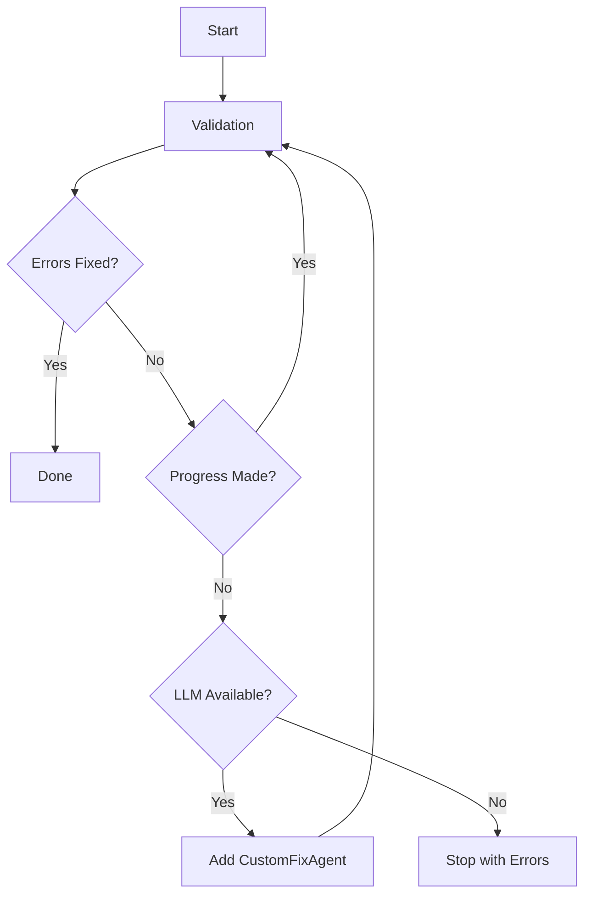
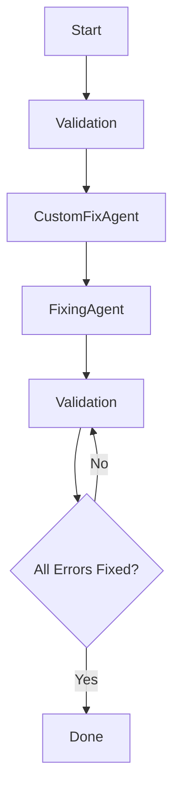

# EPUB Agent Workflow Comparison

## Overview
The EPUB Agent System offers two main workflows when using LLM enhancement:

1. **Basic LLM Usage** (`--llm` flag) - Automatic workflow management
2. **Direct Custom Fix Workflow** (`--workflow` with custom_fixing agent) - Manual workflow control

---

## 1. Basic LLM Usage
```bash
python epub_agent_cli.py your_ebook.epub --llm --max-attempts 5
```

### Workflow Logic


### Key Features
- **Automatic**: Orchestrator decides when to use custom fixes
- **Efficient**: Uses default fixes first (faster)
- **Intelligent**: Only uses LLM when default fixes stall
- **Fallback**: Stops if no LLM is available

### Use Cases
- Most EPUBs
- Quick fixes for common issues
- When you want to let the system handle workflow decisions

---

## 2. Direct Custom Fix Workflow
```bash
python epub_agent_cli.py your_ebook.epub --llm --workflow validation custom_fixing fixing validation
```

### Workflow Logic


### Key Features
- **Manual**: User defines the exact workflow order
- **Guaranteed LLM Fixes**: Always runs custom LLM fixes first
- **Thorough**: LLM fixes + standard fixes = better coverage
- **Flexible**: Can be modified with additional agents

### Use Cases
- Complex EPUBs with stubborn errors
- When standard fixes are known to fail
- For maximum control over the fixing process
- Research/debugging purposes

---

## Performance Comparison

| Metric                  | Basic LLM Usage | Direct Custom Fix |
|-------------------------|-----------------|-------------------|
| **Speed (Initial Run)** | Faster          | Slower            |
| **LLM Usage**           | On-demand       | Always            |
| **Complexity Handling** | Good            | Excellent         |
| **Control**             | Low             | High              |

---

## Which to Choose?

| Scenario                          | Recommended Workflow |
|-----------------------------------|----------------------|
| Common EPUB with known issues     | Basic LLM Usage      |
| Complex EPUB with persistent errors| Direct Custom Fix    |
| Need maximum control              | Direct Custom Fix    |
| Want fast fix for simple issues   | Basic LLM Usage      |
| Debugging fix issues              | Direct Custom Fix    |

---

## Example Outputs

### Basic Usage (On Stall):
```
🔧 Workflow: validation -> fixing -> validation

--- Attempt 1/5 ---
📋 Results: 15 errors → 12 errors
   ✓ Fixed 3 errors!

--- Attempt 2/5 ---
⚠ No progress with default workflow - errors remaining: 12
🔄 Switching to custom LLM-powered fixing...

--- Attempt 3/5 ---
📋 Results: 12 errors → 0 errors
   🎉 All errors fixed!
```

### Direct Custom Fix:
```
🔧 Workflow: validation -> custom_fixing -> fixing -> validation

--- Attempt 1/5 ---
📋 Results: 15 errors → 2 errors
   ✓ Fixed 13 errors!

--- Attempt 2/5 ---
📋 Results: 2 errors → 0 errors
   🎉 All errors fixed!
```
